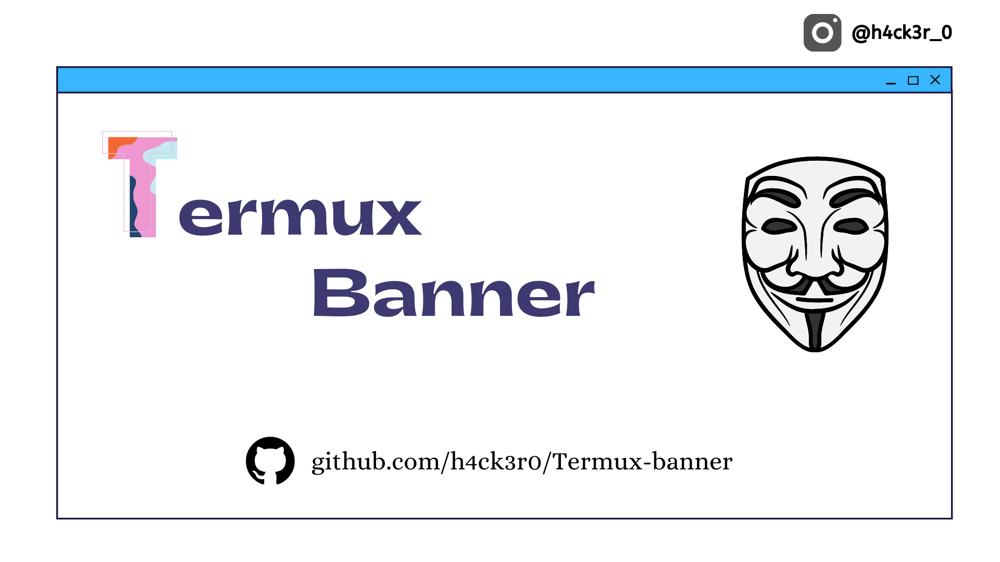

# Termux-banner
<p align="center">
<a href="https://github.com/h4ck3r0/Termux-banner"></a>
</p>
<p align="center">
<a href="https://github.com/h4ck3r0/Termux-banner"></a>
<a href="https://github.com/h4ck3r0/Termux-banner"></a>
<a href="https://github.com/h4ck3r0/Termux-banner"></a>
</p>
<p align="center">
<a href="https://github.com/h4ck3r0/Termux-bannerl"></a>
</p>
<p align="center">
<a href="https://github.com/h4ck3r0/Termux-banner"></a>
<a href="https://youtube.com/c/h4ck3r0"></a>
</p>
<p align="center">
<a href="https://github.com/h4ck3r0"></a>
<a href="https://github.com/h4ck3r0"></a>
<a href="https://github.com/h4ck3r0"></a>
<a href="https://github.com/h4ck3r0"></a>
<a href="https://github.com/h4ck3r0"></a>
<a href="https://github.com/h4ck3r0"></a>
</p>

### AVAILABLE ON :

* Termux

### REQUIREMENTS :
* Zsh shell
* Storage 10 MB
* Pkg - Git ; Wget ; Lolcat ; Zsh ; etc

### FEATURES :
* [+] 10+ Banners ( I will add more soon ) !
* [+] Pure Zsh Theme !
* [+] Auto Suggestion | Highlight !
* [+] Fully Automatic !
* [+] Easy for Beginners !

## INSTALLATION [Termux] :

* `apt-get update -y`
* `apt-get upgrade -y`
* `git clone https://github.com/h4ck3r0/Termux-banner`
* `cd $HOME`
* `ls`
* `cd Termux-banner`
* `chmod +x *`
* `bash setup.sh`
* `bash banner.sh`
```
[+]-- Open new session in termux and Check banner 
```
## CONNECT WITH US :

<a href="https://github.com/h4ck3r0"></a>
[](https://rebrand.ly/loginx202266fb40)
[](https://rebrand.ly/h4ck3r-5064aa)
[](https://rebrand.ly/termuxcoding3d8527)
<a href="https://rebrand.ly/7elzgww"></a>
